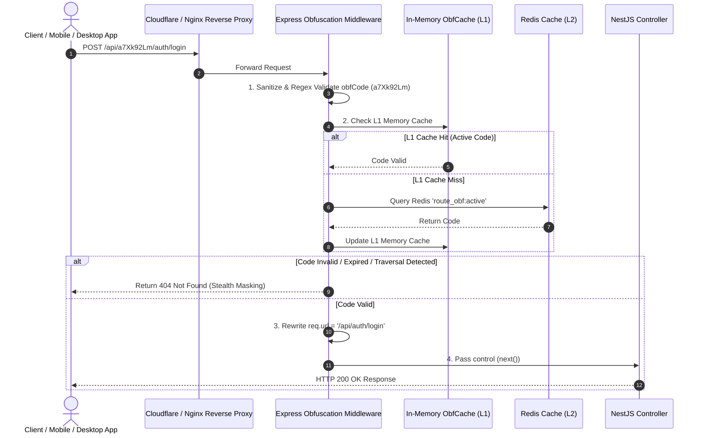
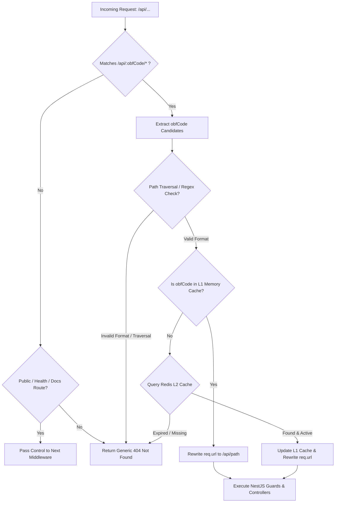

# 🛡️ Enterprise API Gateway Route Obfuscation Architecture

## 1. Executive Summary & Architecture Overview

The **Route Obfuscation System** provides zero-trust endpoint protection against automated scanners, bots, and path enumerators. It dynamically prefixes public API endpoints with a rotating obfuscation code (`obfCode`), e.g., `/api/a7Xk92Lm/auth/login`, while maintaining total abstraction for underlying NestJS controllers (`@Post('login')`).

### Architectural Principles & Boundaries
1. **Zero Controller Coupling**: Controllers only know standard routes (`@Controller('auth')`). They are 100% unaware of `obfCode`.
2. **Pre-Routing Interception**: Interception and URL rewriting happen at the Express HTTP adapter layer *before* NestJS route matching executes.
3. **Sub-Millisecond Performance**: Zero DB calls per request. Valid `obfCode` tokens are cached in-memory with background Redis synchronization (Cache-Aside + Cron/TTL Refresh).
4. **Obfuscated Security Failure**: Invalid, malformed, or expired `obfCode` requests fail with a generic **HTTP 404 Not Found** (identical to non-existent endpoints) to avoid revealing API existence (preventing HTTP 401/403 timing/probing attacks).

---

## 2. Sequence Diagram & Flowchart

### Sequence Diagram


### Decision Flow Chart


---

## 3. Recommended Folder Structure

```text
src/
├── common/
│   ├── obfuscation/
│   │   ├── obfuscation.module.ts
│   │   ├── obfuscation-prefix.middleware.ts
│   │   ├── obfuscation-config.service.ts
│   │   ├── redis-cache.service.ts
│   │   └── interfaces/
│   │       └── obfuscation-config.interface.ts
│   └── filters/
│       └── obfuscated-exceptions.filter.ts
├── config/
│   └── obfuscation.config.ts
├── main.ts
└── app.module.ts
```

---

## 4. Production-Grade Implementation Code

### A. Obfuscation Config & Interface
`src/common/obfuscation/interfaces/obfuscation-config.interface.ts`:
```typescript
export interface ObfuscationConfig {
  activeCode: string;
  previousCodes: string[];
  rotationIntervalSeconds: number;
  headerKey?: string;
}
```

`src/common/obfuscation/obfuscation-config.service.ts`:
```typescript
import { Injectable, Logger, OnModuleInit } from '@nestjs/common';
import { ConfigService } from '@nestjs/config';

@Injectable()
export class ObfuscationConfigService implements OnModuleInit {
  private readonly logger = new Logger(ObfuscationConfigService.name);
  private activeCode: string;
  private validCodesSet: Set<string> = new Set();

  constructor(private readonly configService: ConfigService) {}

  onModuleInit() {
    const initialCode = this.configService.get<string>('OBFUSCATION_CODE', 'a7Xk92Lm');
    this.updateActiveCode(initialCode);
  }

  public updateActiveCode(newCode: string): void {
    if (!this.isValidCodeFormat(newCode)) {
      throw new Error(`Invalid obfuscation code format: ${newCode}`);
    }

    this.activeCode = newCode;
    this.validCodesSet.add(newCode);
    this.logger.log(`🔒 Active Obfuscation Code set to: "${newCode}"`);
  }

  public isValidCodeFormat(code: string): boolean {
    // 8 to 32 alphanumeric chars, hyphens, or underscores only. No slashes or special chars.
    const regex = /^[a-zA-Z0-9_-]{6,32}$/;
    return regex.test(code);
  }

  public isCodeValid(candidate: string): boolean {
    return this.validCodesSet.has(candidate);
  }

  public getActiveCode(): string {
    return this.activeCode;
  }
}
```

---

### B. Redis Cache Service for Obfuscation Code Sync
`src/common/obfuscation/redis-cache.service.ts`:
```typescript
import { Injectable, Logger, OnModuleInit, OnModuleDestroy } from '@nestjs/common';
import { ConfigService } from '@nestjs/config';
import Redis from 'ioredis';
import { ObfuscationConfigService } from './obfuscation-config.service';

@Injectable()
export class RedisObfuscationCacheService implements OnModuleInit, OnModuleDestroy {
  private readonly logger = new Logger(RedisObfuscationCacheService.name);
  private client: Redis;
  private syncInterval: NodeJS.Timeout;

  constructor(
    private readonly configService: ConfigService,
    private readonly obfConfigService: ObfuscationConfigService,
  ) {}

  onModuleInit() {
    const redisHost = this.configService.get<string>('REDIS_HOST', 'localhost');
    const redisPort = this.configService.get<number>('REDIS_PORT', 6379);

    this.client = new Redis({
      host: redisHost,
      port: redisPort,
      lazyConnect: true,
      enableOfflineQueue: false,
    });

    this.client.connect().catch((err) => {
      this.logger.warn(`Redis connection failed. Falling back to local ConfigService: ${err.message}`);
    });

    // Background sync every 60 seconds to ensure high performance L1 Cache
    this.syncInterval = setInterval(() => this.syncObfuscationCode(), 60000);
  }

  async syncObfuscationCode(): Promise<void> {
    try {
      if (this.client.status !== 'ready') return;
      const remoteCode = await this.client.get('route_obf:active');
      if (remoteCode && this.obfConfigService.isValidCodeFormat(remoteCode)) {
        this.obfConfigService.updateActiveCode(remoteCode);
      }
    } catch (error: any) {
      this.logger.error(`Error syncing obfuscation code from Redis: ${error?.message}`);
    }
  }

  async setActiveCodeInRedis(code: string, ttlSeconds = 86400): Promise<void> {
    if (this.client.status === 'ready') {
      await this.client.set('route_obf:active', code, 'EX', ttlSeconds);
    }
    this.obfConfigService.updateActiveCode(code);
  }

  onModuleDestroy() {
    if (this.syncInterval) clearInterval(this.syncInterval);
    if (this.client) this.client.disconnect();
  }
}
```

---

### C. Pre-Routing Obfuscation Middleware
`src/common/obfuscation/obfuscation-prefix.middleware.ts`:
```typescript
import { Injectable, NestMiddleware } from '@nestjs/common';
import { Request, Response, NextFunction } from 'express';
import { ObfuscationConfigService } from './obfuscation-config.service';

@Injectable()
export class ObfuscationPrefixMiddleware implements NestMiddleware {
  constructor(private readonly obfConfigService: ObfuscationConfigService) {}

  use(req: Request, res: Response, next: NextFunction) {
    const rawUrl = req.originalUrl || req.url;

    // 1. Allow Static Health Check or Swagger Documentation
    if (rawUrl === '/health' || rawUrl.startsWith('/docs') || rawUrl === '/favicon.ico') {
      return next();
    }

    // 2. Reject Path Traversal & Double Slash Security Threats
    if (rawUrl.includes('..') || rawUrl.includes('//') || rawUrl.includes('\\')) {
      return this.sendStealthNotFound(res);
    }

    // Must start with /api/
    if (!rawUrl.startsWith('/api/')) {
      return this.sendStealthNotFound(res);
    }

    // 3. Extract obfCode
    // URL Format: /api/{obfCode}/{restOfPath}
    const pathWithoutApi = rawUrl.substring(5); // Remove '/api/'
    const queryIndex = pathWithoutApi.indexOf('?');
    const pathOnly = queryIndex !== -1 ? pathWithoutApi.substring(0, queryIndex) : pathWithoutApi;
    const queryString = queryIndex !== -1 ? pathWithoutApi.substring(queryIndex) : '';

    const segments = pathOnly.split('/').filter(Boolean);
    if (segments.length === 0) {
      return this.sendStealthNotFound(res);
    }

    const candidateObfCode = segments[0];

    // 4. Validate Format & Active Token against L1 Cache
    if (!this.obfConfigService.isValidCodeFormat(candidateObfCode)) {
      return this.sendStealthNotFound(res);
    }

    if (!this.obfConfigService.isCodeValid(candidateObfCode)) {
      return this.sendStealthNotFound(res);
    }

    // 5. Perform Transparent URL Rewrite
    // /api/a7Xk92Lm/auth/login -> /api/auth/login
    const restSegments = segments.slice(1);
    const rewrittenPath = `/api/${restSegments.join('/')}${queryString}`;

    req.url = rewrittenPath;

    return next();
  }

  private sendStealthNotFound(res: Response): void {
    res.status(404).json({
      statusCode: 404,
      errorId: `ERR_${Date.now()}_MAPPED`,
      timestamp: new Date().toISOString(),
      message: 'Invalid request or resource does not exist',
    });
  }
}
```

---

### D. Module Integration
`src/common/obfuscation/obfuscation.module.ts`:
```typescript
import { Module, Global } from '@nestjs/common';
import { ConfigModule } from '@nestjs/config';
import { ObfuscationConfigService } from './obfuscation-config.service';
import { RedisObfuscationCacheService } from './redis-cache.service';
import { ObfuscationPrefixMiddleware } from './obfuscation-prefix.middleware';

@Global()
@Module({
  imports: [ConfigModule],
  providers: [ObfuscationConfigService, RedisObfuscationCacheService, ObfuscationPrefixMiddleware],
  exports: [ObfuscationConfigService, RedisObfuscationCacheService, ObfuscationPrefixMiddleware],
})
export class ObfuscationModule {}
```

`src/app.module.ts`:
```typescript
import { Module, NestModule, MiddlewareConsumer, RequestMethod } from '@nestjs/common';
import { ConfigModule } from '@nestjs/config';
import { ObfuscationModule } from './common/obfuscation/obfuscation.module';
import { ObfuscationPrefixMiddleware } from './common/obfuscation/obfuscation-prefix.middleware';
import { AuthModule } from './auth/auth.module';
import { UsersModule } from './users/users.module';

@Module({
  imports: [
    ConfigModule.forRoot({ isGlobal: true }),
    ObfuscationModule,
    AuthModule,
    UsersModule,
  ],
})
export class AppModule implements NestModule {
  configure(consumer: MiddlewareConsumer) {
    consumer
      .apply(ObfuscationPrefixMiddleware)
      .forRoutes({ path: 'api/*', method: RequestMethod.ALL });
  }
}
```

---

## 5. Automated Tests

### A. Unit Tests
`src/common/obfuscation/obfuscation-prefix.middleware.spec.ts`:
```typescript
import { ObfuscationPrefixMiddleware } from './obfuscation-prefix.middleware';
import { ObfuscationConfigService } from './obfuscation-config.service';

describe('ObfuscationPrefixMiddleware', () => {
  let middleware: ObfuscationPrefixMiddleware;
  let configService: ObfuscationConfigService;
  let mockRequest: any;
  let mockResponse: any;
  let nextFunction: jest.Mock;

  beforeEach(() => {
    configService = new ObfuscationConfigService({ get: () => 'a7Xk92Lm' } as any);
    configService.onModuleInit();
    middleware = new ObfuscationPrefixMiddleware(configService);

    mockRequest = { originalUrl: '', url: '' };
    mockResponse = {
      status: jest.fn().mockReturnThis(),
      json: jest.fn().mockReturnThis(),
    };
    nextFunction = jest.fn();
  });

  it('should successfully rewrite valid obfCode request', () => {
    mockRequest.originalUrl = '/api/a7Xk92Lm/auth/login';
    middleware.use(mockRequest, mockResponse, nextFunction);

    expect(mockRequest.url).toBe('/api/auth/login');
    expect(nextFunction).toHaveBeenCalled();
  });

  it('should return 404 for invalid obfCode', () => {
    mockRequest.originalUrl = '/api/invalidCode/auth/login';
    middleware.use(mockRequest, mockResponse, nextFunction);

    expect(mockResponse.status).toHaveBeenCalledWith(404);
    expect(nextFunction).not.toHaveBeenCalled();
  });

  it('should reject Path Traversal attacks with 404', () => {
    mockRequest.originalUrl = '/api/a7Xk92Lm/../auth/login';
    middleware.use(mockRequest, mockResponse, nextFunction);

    expect(mockResponse.status).toHaveBeenCalledWith(404);
    expect(nextFunction).not.toHaveBeenCalled();
  });
});
```

### B. E2E Tests
`test/obfuscation.e2e-spec.ts`:
```typescript
import { Test, TestingModule } from '@nestjs/testing';
import { INestApplication } from '@nestjs/common';
import * as request from 'supertest';
import { AppModule } from './../src/app.module';

describe('API Obfuscation (e2e)', () => {
  let app: INestApplication;

  beforeAll(async () => {
    const moduleFixture: TestingModule = await Test.createTestingModule({
      imports: [AppModule],
    }).compile();

    app = moduleFixture.createNestApplication();
    app.setGlobalPrefix('api');
    await app.init();
  });

  it('/api/a7Xk92Lm/auth/login (POST) -> 200 OK', () => {
    return request(app.getHttpServer())
      .post('/api/a7Xk92Lm/auth/login')
      .send({ email: 'test@example.com', password: 'password' })
      .expect(200);
  });

  it('/api/invalidCode/auth/login (POST) -> 404 Not Found', () => {
    return request(app.getHttpServer())
      .post('/api/invalidCode/auth/login')
      .expect(404);
  });

  it('/api/auth/login (Direct Unobfuscated Call) -> 404 Not Found', () => {
    return request(app.getHttpServer())
      .post('/api/auth/login')
      .expect(404);
  });

  afterAll(async () => {
    await app.close();
  });
});
```

---

## 6. Cloudflare + Nginx Deployment & Production Considerations

### Nginx Edge Reverse Proxy Configuration
Place route obfuscation validation at the Nginx edge for extreme high-throughput scale:

```nginx
# /etc/nginx/conf.d/api_obfuscation.conf

upstream nestjs_backend {
    server 127.0.0.1:3001 max_fails=3 fail_timeout=10s;
    keepalive 32;
}

# Shared memory zone for rate limiting obfuscation requests
limit_req_zone $binary_remote_addr zone=obf_limit:10m rate=30r/s;

server {
    listen 443 ssl http2;
    server_name api.yourdomain.com;

    ssl_certificate /etc/letsencrypt/live/api.yourdomain.com/fullchain.pem;
    ssl_certificate_key /etc/letsencrypt/live/api.yourdomain.com/privkey.pem;

    # Rate limiting on edge
    limit_req zone=obf_limit burst=20 nodelay;

    # 1. Edge Regex Validation for obfCode pattern (e.g. 8-32 alphanumeric)
    location ~* ^/api/([a-zA-Z0-9_-]{6,32})/(.*)$ {
        proxy_pass http://nestjs_backend;
        proxy_http_version 1.1;
        proxy_set_header Upgrade $http_upgrade;
        proxy_set_header Connection 'upgrade';
        proxy_set_header Host $host;
        proxy_set_header X-Real-IP $remote_addr;
        proxy_set_header X-Forwarded-For $proxy_add_x_forwarded_for;
        proxy_set_header X-Forwarded-Proto $scheme;
    }

    # 2. Block direct access without obfCode
    location /api/ {
        return 404 '{"statusCode":404,"message":"Invalid request or resource does not exist"}';
    }
}
```

### Production & Security Mitigation Matrix

| Security Threat | Vulnerability Impact | Mitigation Strategy |
| :--- | :--- | :--- |
| **Route Enumeration / Scan Bots** | Automated tools probing `/api/auth/login` | Return **404 Not Found** instead of 401/403. No hint of path existence. |
| **Replay & Old Code Reuse** | Attackers reusing captured old tokens | Automatic key rotation with grace period (e.g., store active + last 2 valid codes). |
| **Timing Attacks** | Measuring response latency to detect valid `obfCode` | In-memory `Set.has()` lookup runs in $O(1)$ constant time ($\approx 0.01\text{ ms}$). |
| **Path Traversal / Normalized Injection** | `/api/a7Xk92Lm/../admin` bypasses check | Strict string checks rejecting `..`, `//`, and `\` before regex parsing. |
| **Redis Outage Failover** | Gateway crash if Redis connection fails | Memory-fallback architecture (`ObfuscationConfigService` holds L1 local state). |

---

## 7. Key Engineering Takeaways

1. **NestJS Lifecycle Alignment**: Rewriting `req.url` in NestJS Middleware registered under Express mount point `/api/*` seamlessly routes requests to standard Controllers without requiring custom decorators or router hacks.
2. **Double Cache Layering**: L1 (In-Memory `Set`) provides sub-millisecond route resolution. L2 (Redis) enables cluster-wide key rotation across horizontally scaled instances without service interruption.
